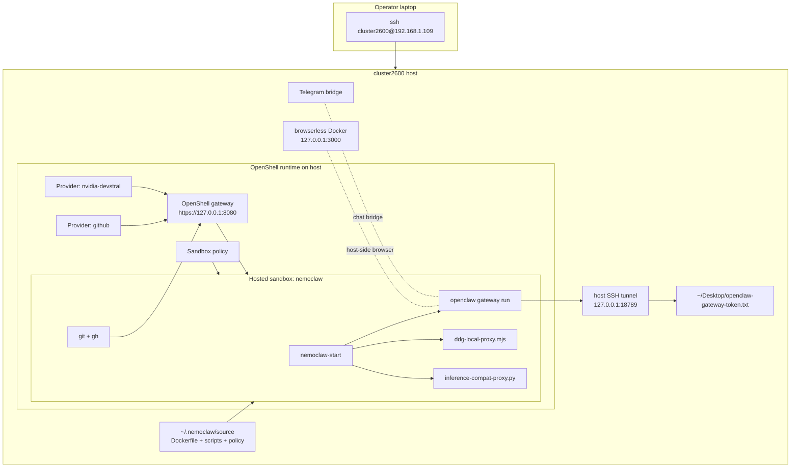
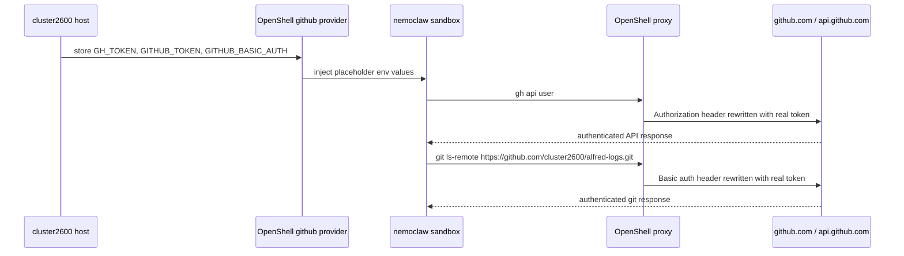
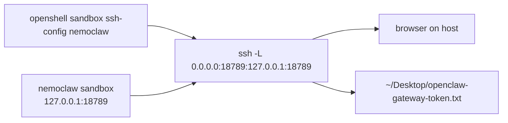

---
title:
  page: "Cluster2600 Runtime Notes for NemoClaw and OpenClaw"
  nav: "Cluster2600 Runtime"
description: "Operational notes for the cluster2600 NemoClaw deployment, including GitHub access, dashboard exposure, browser tooling, and recovery commands."
keywords: ["nemoclaw cluster2600", "nemoclaw github provider", "nemoclaw dashboard tunnel", "openclaw remote runtime"]
topics: ["generative_ai", "ai_agents"]
tags: ["openclaw", "openshell", "deployment", "github", "telegram", "browserless", "nemoclaw"]
content:
  type: how_to
  difficulty: intermediate
  audience: ["developer", "engineer"]
status: published
---

<!--
  SPDX-FileCopyrightText: Copyright (c) 2025-2026 NVIDIA CORPORATION & AFFILIATES. All rights reserved.
  SPDX-License-Identifier: Apache-2.0
-->

# Cluster2600 Runtime Notes

This page documents the remote `cluster2600` NemoClaw environment as it was configured on March 30-31, 2026.
It captures the operational changes made to get OpenClaw, GitHub access, Browserless, and the dashboard working together on a real remote host.

## Scope

These notes cover the `cluster2600` host at `192.168.1.109`, where the OpenShell runtime hosts the `nemoclaw` sandbox rebuilt from this repository and mediates provider routing, policy enforcement, and sandbox access.

The main outcomes were:

- rebuilt the NemoClaw sandbox image with a working `gh` binary and browser dependencies
- upgraded the sandboxed OpenClaw install to `2026.3.28`
- routed GitHub access through an OpenShell-backed `github` provider instead of storing raw credentials in the sandbox
- restored the dashboard through a host-side tunnel and desktop token file
- enabled auxiliary services such as the Telegram bridge and a host-side Browserless container

## Runtime Topology

In this deployment, OpenShell is the host runtime. `nemoclaw` is the OpenShell-hosted sandbox environment that runs OpenClaw and the helper processes described below.



## Security Model Used on This Host

The deployment was kept on the host-only secret model:

- provider credentials stay on the host
- the sandbox only receives OpenShell placeholder values such as `openshell:resolve:env:GH_TOKEN`
- OpenShell owns the real secret and proxy rewrite path
- no raw GitHub token is written into the sandbox filesystem

For GitHub, the host provider was populated with three credential keys:

- `GH_TOKEN`
- `GITHUB_TOKEN`
- `GITHUB_BASIC_AUTH`

`GITHUB_BASIC_AUTH` is the base64-encoded `x-access-token:<token>` form needed by GitHub HTTPS git traffic.
Inside the sandbox, those values appear only as placeholders and are rewritten by OpenShell on the outbound path.



## Image and Startup Changes

The sandbox image was rebuilt from this repository with the following runtime changes:

- install `gh` in the image so GitHub CLI is available inside the sandbox
- keep OpenClaw at `2026.3.28`
- keep Chromium runtime libraries and Patchright browser cache in the image
- carry the DDG HTML proxy and inference compatibility proxy scripts in `/usr/local/bin`
- copy the patched `scripts/nemoclaw-start.sh` into the image

The startup script now does two GitHub-related things:

1. exports TLS trust for the OpenShell CA bundle
2. writes `/sandbox/.gitconfig` explicitly so `git` always has:
   - `http.sslCAInfo=/etc/openshell-tls/ca-bundle.pem`
   - `http.https://github.com/.extraheader=Authorization: Basic openshell:resolve:env:GITHUB_BASIC_AUTH`

This explicit file write matters because SSH-launched sandbox sessions also use `HOME=/sandbox`, and relying on implicit global config creation was not reliable enough.

## Network Policy Changes

The `cluster2600` sandbox policy was extended to allow the binaries that matter for this environment:

- OpenClaw and Node runtime traffic for web fetch and provider access
- `git`, `gh`, and `git-remote-https` to GitHub hosts
- Brave search and job-site access used by the `alfred-logs` workload

GitHub-related hosts explicitly allowed in policy include:

- `github.com`
- `api.github.com`
- `raw.githubusercontent.com`
- `codeload.github.com`
- `objects.githubusercontent.com`
- `uploads.github.com`

One consequence of the policy model is that generic tools such as `curl` may still be denied even when `git` and `gh` work, because policy is binary-specific.

## GitHub Access Path

The host and sandbox now use this pattern:

1. the host authenticates `gh`
2. the host creates or updates the OpenShell `github` provider
3. sandbox creation attaches `--provider github`, so OpenShell exposes placeholder credentials into the hosted sandbox
4. `gh` reads placeholder env vars inside the sandbox
5. `git` reads `/sandbox/.gitconfig` for the GitHub HTTPS auth header

The current verification commands used on `cluster2600` are:

```console
$ gh api user -q .login
cluster2600

$ git ls-remote https://github.com/cluster2600/alfred-logs.git HEAD
9264edf28f78d5c7be3d2532888081a25397a60c  HEAD
```

## Dashboard and Gateway Exposure

The OpenClaw gateway inside the sandbox listens on `127.0.0.1:18789`.
The host exposes that through an SSH forward generated from `openshell sandbox ssh-config`.

The tokenized URLs are written to:

```text
~/Desktop/openclaw-gateway-token.txt
```

This file is rewritten whenever the sandbox is recreated because the gateway token changes on each fresh OpenClaw config.



## Auxiliary Services

### Telegram bridge

The Telegram bridge is driven from host-only environment material in:

```text
~/.nemoclaw/services.env
```

The bridge is started with:

```console
$ /home/cluster2600/.nemoclaw/source/scripts/start-services.sh --sandbox nemoclaw
```

### Browserless

A host Docker `browserless` container was used as an external browser service when the sandbox browser path was insufficient or policy-constrained.
That service runs on:

```text
http://127.0.0.1:3000
```

The Browserless token and local URL were written to a desktop text file during setup.

## Recovery Commands

These are the commands that mattered most when recovering the host after reboots or sandbox recreates.

### Recreate the sandbox from the current repo

```console
$ ~/.local/bin/openshell sandbox create \
    --from /home/cluster2600/.nemoclaw/source/Dockerfile \
    --name nemoclaw \
    --provider nvidia-devstral \
    --provider github \
    --policy /home/cluster2600/.nemoclaw/source/policy/sandbox-policy.yaml \
    -- env nemoclaw-start
```

### Verify GitHub from inside the sandbox

```console
$ gh api user -q .login
$ git ls-remote https://github.com/cluster2600/alfred-logs.git HEAD
```

### Restore the dashboard tunnel

```console
$ cfg="$(mktemp)"
$ ~/.local/bin/openshell sandbox ssh-config nemoclaw >"$cfg"
$ ssh -n -N -F "$cfg" -L 0.0.0.0:18789:127.0.0.1:18789 openshell-nemoclaw
```

### If the gateway did not start during create

```console
$ cfg="$(mktemp)"
$ ~/.local/bin/openshell sandbox ssh-config nemoclaw >"$cfg"
$ ssh -n -F "$cfg" openshell-nemoclaw "bash -lc 'nohup env nemoclaw-start >/tmp/nemoclaw-start.log 2>&1 &'"
```

## Files Touched During This Work

The main repository files changed for this `cluster2600` deployment were:

- `Dockerfile`
- `Dockerfile.base`
- `bin/lib/onboard.js`
- `package.json`
- `package-lock.json`
- `policy/sandbox-policy.yaml`
- `scripts/ddg-local-proxy.mjs`
- `scripts/inference-compat-proxy.py`
- `scripts/nemoclaw-start.sh`
- `scripts/setup.sh`
- `vendor/`

Those changes should be read together: the image, startup, policy, and OpenClaw runtime patches were all required to make the remote environment behave consistently.

## Known Caveats

- The host currently runs the `openshell` gateway name, not `nemoclaw`. Recovery commands should target the active `openshell` gateway.
- `curl` to GitHub may still be denied even when `git` and `gh` work, because the policy is scoped to specific binaries.
- Dashboard tokens are ephemeral and change after sandbox recreation.
- Browserless is host-side. It is not a sandbox secret and should not be treated as one.
