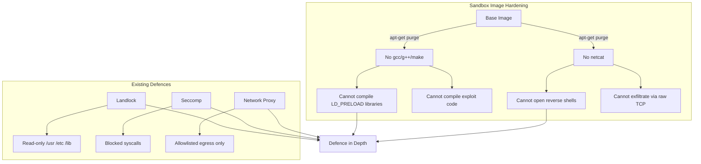

# Sandbox Image Hardening

## Attack Surface Reduction

The NemoClaw sandbox image is hardened by removing unnecessary tools that could
be used by a compromised or prompt-injected agent.

### Removed Packages

| Package | Risk | Reference |
|---------|------|-----------|
| gcc, g++, cpp, make | Compile exploit code, LD_PRELOAD injection | [#807](https://github.com/NVIDIA/NemoClaw/issues/807) |
| netcat-openbsd, netcat-traditional | Reverse shells, raw TCP exfiltration | [#808](https://github.com/NVIDIA/NemoClaw/issues/808) |

### Defence Layers

Even if one layer is bypassed, the others provide protection. Removing tools
from the image means an attacker who escapes the proxy still cannot compile
custom tooling or open raw TCP connections.
